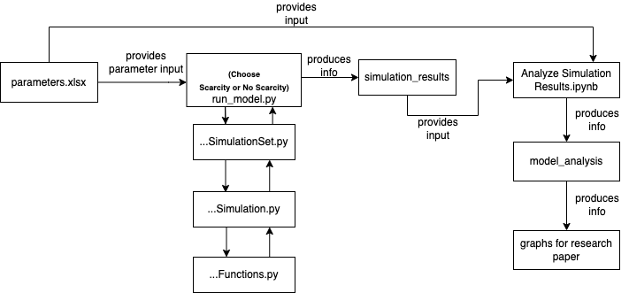

# Mathematical Model

## Introduction
We see two directories which contains the code of two overarching versions of our model.
1. **No Scarcity Model** - This model does not have a limit to the number of people who are promoted.
2. **Scarcity Model** - This model does have a limit to the number of people who can be promoted.

The paper contains a more detailed explanation on the models work. Note that this simulation has an aspect of randomness.

## About Files

### Diagram
This shows how all the files generally work together.

### The Inputs

**`parameters.xlsx`**:  Note that this file is used in both `run_model.py` and `Analyze Simulation Results.ipynb`. Changing this file name, its sheet names or any of its values will affect both the model and the analysis of the simulation results. For a more comprehensive understanding of `parameters.xlsx`, read `ParametersInfo.md`.
1. The **sheet** (or tab) name shows the investigated parameter ($a$,  $\alpha$, $\beta$ or both $a$ and $\alpha$) and the effect of other preset parameters. The sheet names should not be changed. If changed, the sheet name must follow naming conventions. More details are in `ParametersInfo.md`.
2. Each **row** in a sheet represents a certain combination of parameters. The parameter value that is being investigated in that sheet is varied in value in each row. This combination/set of parameters is run 50 different times.
    More details are in `ParametersInfo.md` which details how one can change the parameter values.

### The Models (No Scarcity and Scarcity Directories)
1. **`BambooCeilingModelFunctions.py`**: Each directory contains the same files. The difference in how the models are coded mainly lies in the `BambooCeilingModelFunctions.py` file. This file contains multiple functions in which the foundational details of the model are created.

2. **`BambooCeilingModelSimulation.py`**: This model runs one formal simulation of the model with given inputs. It uses the `BambooCeilingModelFunctions.py` file and brings all the different functions together to run the model.

3. **`BambooCeilingModelSimulationSet.py`**: This file runs 50 simulations given a set of parameters.

4. **`run_model.py`**: This file takes the inputted file ( `parameters.xlsx`) and uses the values in these files to run 50 simulations (using `BambooCeilingModelSimulationSet.py`)  of every single desired combination from the `parameters.xlsx` file. 
#### To run your own parameter values
1. **`parameters.xlsx`**: To run your own parameter values, change the `parameters.xlsx` sheet accordingly. (Read **`ParametersInfo.md`** first).
2. **`run_model.py`**: To run parameters from a specific sheet of `parameters.xlsx` , open `run_model.py` set `run_all` in this file to `false` and change `input_sheet_name_indices` to the index (or indices) of the desired sheet(s), which starts at 0.

### Analyzing Results
**`Analyzing Simulation Results.ipynb`**: Uses results from the (indicated) model and `parameters.xlsx`. If one changes the sheet names in `parameters.xlsx` incorrectly, this file would be impacted. This file reads, analyzes, graphs and stores the graphed results in `model_analysis` directory. The graphs that are used in the paper are located in the `model_analysis/graphs` directory. The other directory `t-comparison` is now irrelevant. To make your own visualization:
1. Choose model (`model_input`)
2. Run all cells in Section 1
3. Change inputs as desired (Section 2) to generate desired visualization

